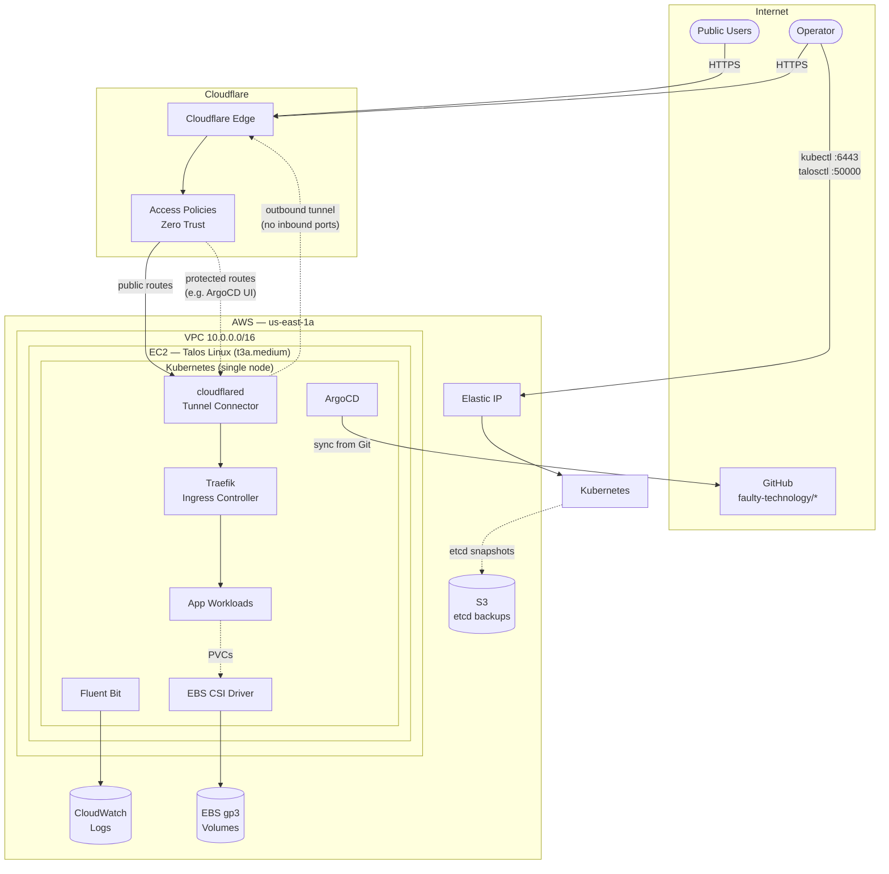
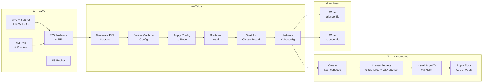
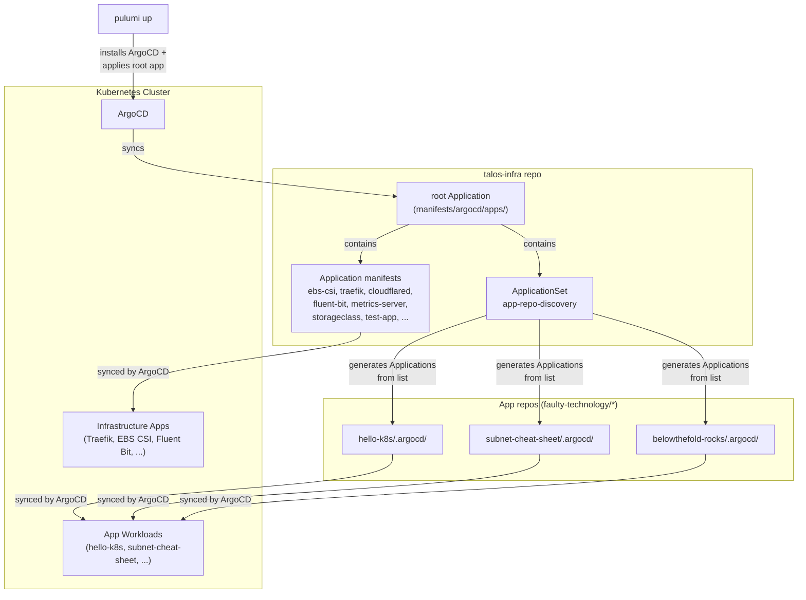

# Talos Cluster — Phase 0 (Single Node)

Single Talos Linux node on AWS running both control plane and workloads.
ArgoCD manages all Kubernetes apps via App of Apps pattern. ~$31-34/mo.

## Quick Start

```bash
# 1. Install prerequisites (AWS CLI, talosctl, kubectl, helm)
chmod +x scripts/*.sh
./scripts/bootstrap-prerequisites.sh

# 2. Configure AWS credentials (if not done yet)
aws configure
#   Access Key ID:     <from IAM>
#   Secret Access Key: <from IAM>
#   Region:            us-east-1
#   Output:            json

# 3. Configure secrets (one-time)
npm install
source .env.local
pulumi stack init dev
pulumi config set --secret talos-cluster:allowedCidrs '["<your-ip>/32"]'
pulumi config set --secret talos-cluster:cloudflareTunnelToken <token>
pulumi config set --secret talos-cluster:githubAppId <id>
pulumi config set --secret talos-cluster:githubAppInstallationId <id>
# Multi-line PEM — pipe via stdin with trailing --
cat <path/to/github-app.pem> | pulumi config set --secret talos-cluster:githubAppPrivateKey --

# 4. Deploy everything (AWS + Talos + K8s secrets + ArgoCD)
pulumi up

# 5. Verify
export KUBECONFIG=.talos/kubeconfig
kubectl get nodes
kubectl get pods -A
```

## What Gets Created

### AWS Resources (via Pulumi)

- VPC with 1 public subnet (us-east-1a)
- Internet gateway + route table
- Security group (ports 6443 + 50000 inbound, restricted to configured CIDR; all outbound)
- IAM role with EBS CSI + CloudWatch Logs permissions
- S3 bucket for etcd backups (versioned, encrypted, 30-day lifecycle)
- t3a.medium EC2 instance running Talos Linux
- Elastic IP (stable address across restarts)

### Kubernetes Components (via ArgoCD App of Apps)

- **ArgoCD** — GitOps controller, manages all apps below
- **argocd-ingress** — Traefik IngressRoute for ArgoCD UI
- **EBS CSI driver** — gp3 StorageClass (default, encrypted)
- **Fluent Bit** — log shipping to CloudWatch
- **Metrics Server** — enables `kubectl top`
- **Traefik** — ingress controller (ClusterIP, no LB needed)
- **cloudflared** — Cloudflare Tunnel connector
- **StorageClass** — gp3 encrypted default
- **test-app** — sample deployment for validation
- **project-apps** — AppProject constraining app workloads
- **app-repo-discovery** — ApplicationSet that auto-generates Applications from a list of external repos (each repo provides its own config in `.argocd/`)

## Day 2 Operations

### Access the cluster

```bash
source .env.local
# or manually:
export KUBECONFIG=.talos/kubeconfig
export TALOSCONFIG=.talos/talosconfig
```

### Talos dashboard

```bash
talosctl dashboard
```

### ArgoCD UI

```bash
kubectl port-forward -n argocd svc/argocd-server 8080:443
# https://localhost:8080
# Username: admin
# Password: kubectl -n argocd get secret argocd-initial-admin-secret -o jsonpath="{.data.password}" | base64 -d
```

### Onboard a new app repo

The `app-repo-discovery` ApplicationSet uses a list-based generator. Each app repo provides its own ArgoCD config in a `.argocd/` directory. To add a new repo, append an entry to the list in `manifests/argocd/apps/app-repo-discovery.yaml`:

```yaml
generators:
  - list:
      elements:
        - repo: hello-k8s
          branch: main
        - repo: my-new-app # <-- add here
          branch: main
```

ArgoCD will auto-create an Application pointing to `https://github.com/faulty-technology/<repo>.git` and sync from its `.argocd/` directory. See [hello-k8s/.argocd/](https://github.com/faulty-technology/hello-k8s/tree/main/.argocd) for a working example.

### etcd backup

```bash
./scripts/ops-etcd-backup.sh           # Local snapshot
./scripts/ops-etcd-backup.sh --s3      # Also upload to S3
```

### Stop (save money) / Start the node

```bash
# Stop
aws ec2 stop-instances --instance-ids $(pulumi stack output nodeInstanceId)

# Start
aws ec2 start-instances --instance-ids $(pulumi stack output nodeInstanceId)
# EIP stays attached — same public IP after restart
```

### Tear down everything

```bash
pulumi destroy
```

## Security Notes

- Talos PKI is stored in Pulumi state — back up your Pulumi state backend
- If Pulumi state is lost, the cluster is **unrecoverable** (Talos has no SSH, no SSM, no console)
- `.talos/` contains client credentials — treat like SSH keys
- Security group restricts inbound to `allowedCidrs` in Pulumi config — set this to your IP

## Cost Breakdown

| Component                | Monthly     |
| ------------------------ | ----------- |
| t3a.medium (on-demand)   | ~$28        |
| EBS gp3 root (20GB)      | ~$1.60      |
| EBS gp3 PVCs (est. 20GB) | ~$1.60      |
| Elastic IP (attached)    | $0          |
| Cloudflare Tunnel        | $0          |
| **Total**                | **~$31-34** |

Note: Elastic IPs are free when attached to a running instance.
Stopped instances with attached EIPs cost ~$0.005/hr ($3.60/mo).

## Architecture Diagrams

### System Overview

High-level view of the running system — what talks to what.



### Pulumi Deployment Pipeline

What `pulumi up` does — the sequential steps from zero to running cluster.



### ArgoCD GitOps Flow

How ArgoCD manages cluster workloads after initial deployment.


